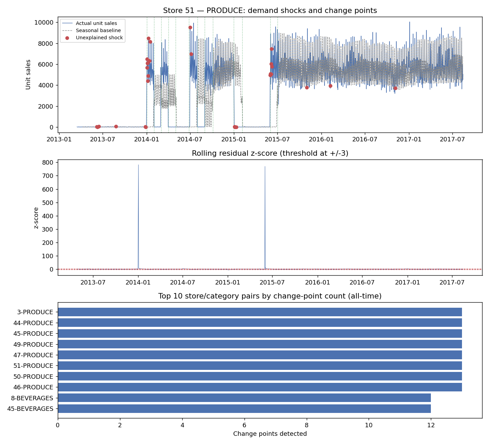
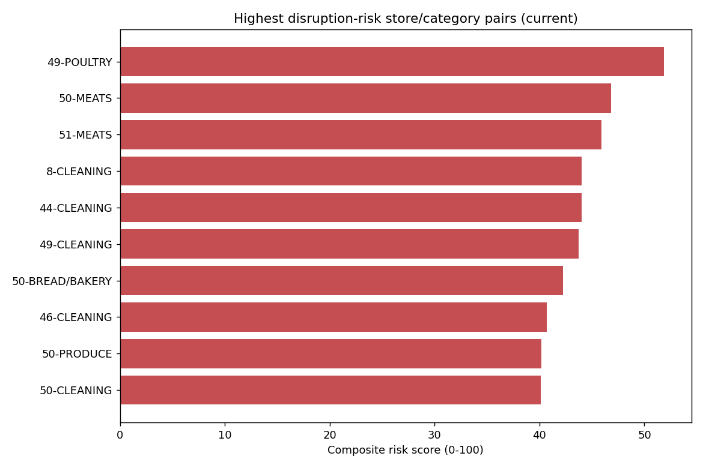
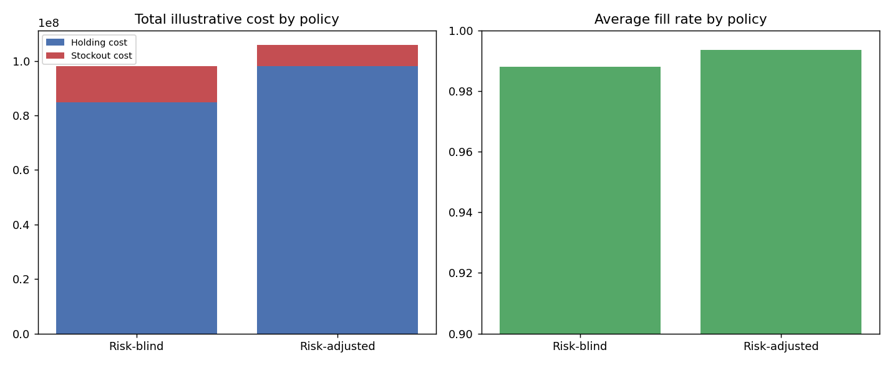

# Supply Chain Disruption Risk Intelligence

A working proof-of-concept for the risk-intelligence piece of my broader
AI-Powered Predictive Supply Chain Resilience Framework — this one flags
demand disruptions, turns them into a composite risk score per
store/product category, and feeds that score back into inventory planning
so high-risk categories carry more buffer.

It builds directly on my earlier
[retail-demand-forecasting](https://github.com/MIthila-Samapti/retail-demand-forecasting)
project, reusing its cleaned daily sales panel rather than starting from
raw data again.

## Problem

A forecast tells you what you expect to sell. It doesn't tell you how much
to trust that number for a given product this week, or which categories
are quietly becoming higher-risk to stock. This project adds that layer:
detect unexplained demand shocks, score disruption risk per
store/category, and translate that score into a concrete inventory
decision.

## Data

`data/processed/daily_sales_by_store_family.csv` — the same panel from the
demand-forecasting project (10 stores, 8 product families, 2013-2017),
already carrying promotion, holiday, and oil-price context. See
`data/README.md`.

## Methodology

1. **Disruption detection** (done) — flag demand shocks in the daily
   sales series that aren't explained by known promotions or holidays,
   using rolling z-scores on a seasonal baseline, cross-checked with PELT
   change-point detection (`ruptures`) on each store/category series. See
   `notebooks/01_disruption_detection.ipynb`.
2. **Composite risk scoring** (done) — percentile-rank the shock rate,
   average shock severity, and change-point rate per store/category,
   blend with an oil-price-volatility macro overlay, into one 0-100
   composite risk score per store/category/day. See
   `notebooks/02_composite_risk_scoring.ipynb`.
3. **Risk-adjusted inventory** (done) — safety stock scales day-by-day
   with the composite risk score (up to 50% more buffer at a risk score
   of 100), and I simulated a risk-blind vs. risk-adjusted replenishment
   policy across the full history to see what that actually costs. See
   `notebooks/03_risk_adjusted_inventory.ipynb`.
4. **Reporting** (done) — tidy exports in `reports/tableau_export/` for
   Tableau/Power BI, same pattern as the first project.

## Results so far (Phase 1)

Across 133,096 store/category/day observations (10 stores x 8 categories,
2013-2017): 912 unexplained demand shocks flagged (0.7%), and 332 change
points detected where a series' underlying demand level shifted.

The change points weren't evenly spread — PRODUCE accounted for most of
the top hits. Investigating why turned up a real, large discontinuity:
unit sales for PRODUCE jump from roughly 10-50 units/day to roughly
4,000-8,000 units/day almost overnight on January 2, 2014, consistently
across nearly every store. The most likely explanation is the store
network expanding its tracked produce assortment around that date, not
an actual 250x jump in demand — exactly the kind of thing this layer is
meant to surface for a human to verify, rather than silently absorb into
a forecast. It's also why the risk summary is windowed to the most recent
90 days rather than all-time history, so an old structural break like
this one doesn't drown out current risk. See the notebook for the full
walkthrough.

## Results so far (Phase 2)

The composite score is a continuous, rolling number, not a one-time
snapshot, which made it possible to sanity-check it against Phase 1's
own finding: for Store 51 / PRODUCE, the score jumps from its baseline
into the 80s-90s within two weeks of the known January 2014 disruption
and stays elevated for roughly the following 90 days, exactly the
trailing-window behavior it should show. That's the check that the score
is tracking real signal, not just noise.

As of the most recent date in the data, the highest-risk store/category
pairs are led by Store 49 - POULTRY (composite score ~52), driven mostly
by elevated average shock severity rather than shock frequency, since
most series had no shocks at all in their most recent 90-day window —
worth knowing, because it means the current ranking is more a "which
categories are noisiest right now" signal than a "which categories are
actively disrupted right now" signal. See
`reports/latest_risk_ranking.csv` for the full ranking and
`reports/composite_risk_history.csv` for the full daily time series.

## Results so far (Phase 3)

Store-level forecast error isn't available (the original backtest was
family-level only), so I allocated each family's error down to stores by
volume share, noted as an approximation rather than a measured number.

Across all 80 store/category series, the risk-adjusted policy cuts
stockout cost by about 41% and raises holding cost by about 16%,
netting out to roughly 8% higher total illustrative cost than the
risk-blind policy. It's not a free win — it's a real trade-off: better
service level in exchange for carrying more buffer through years of
mostly-quiet data to be ready for the handful of actual disruption
episodes. Whether that trade is worth it depends on a company's real
stockout cost vs. holding cost, not the illustrative $2.00/$0.05 figures
used here. See `reports/risk_adjusted_inventory_comparison.csv`.

## Project structure

```
src/            core Python modules
notebooks/      exploration and write-ups, in order
reports/        result exports and figures
tests/          unit tests (pytest)
data/           processed data (raw data, if any is added, is not committed)
```

## Figures







## Setup

```bash
python -m venv venv
source venv/bin/activate  # venv\Scripts\activate on Windows
pip install -r requirements.txt
pytest
```

## Author

Mithila Zaman Samapti — [retail-demand-forecasting](https://github.com/MIthila-Samapti/retail-demand-forecasting) is the companion project this one builds on.
